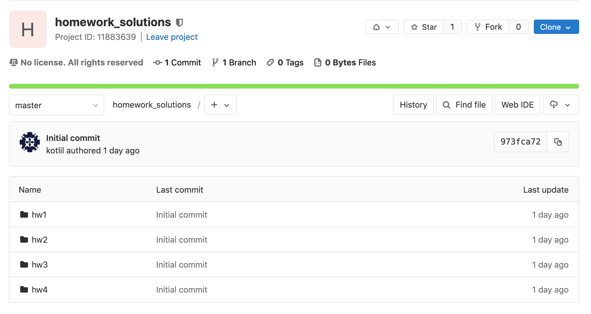

# Zadání domácích úkolů

V levé liště najdete sady domácích úkolů a materiály k procvičení.

## Prerekvizita

Odevzdávání domácích úkolu bude probíhat přes Gitlab.

- Zaregistrujte se na [Gitlab.com](https://gitlab.com)
- Vytvořte si nový projekt
  - Project name: `homework_solutions`
  - Visibility level: `private`
- V nastavení projektu otevřete stránku `members`. V sekci `invite member` přiřaďte uživatele `uxes` a `asciidan` s rolí `maintainer`

Ukázka projektu:

